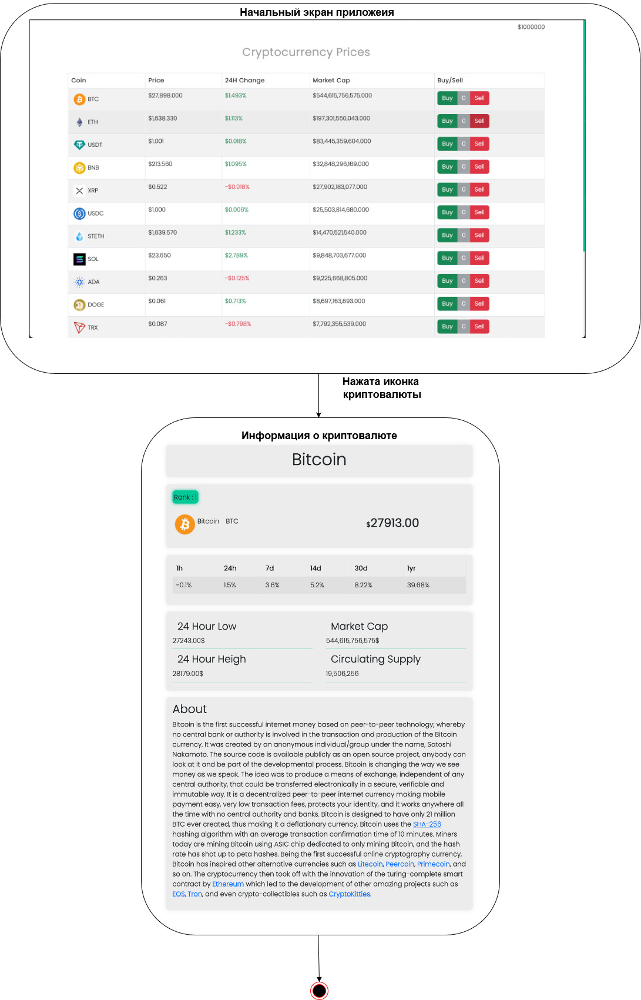
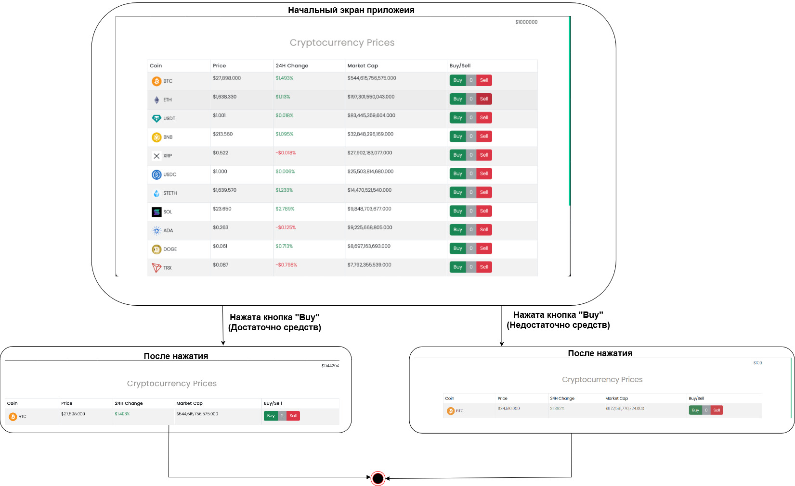
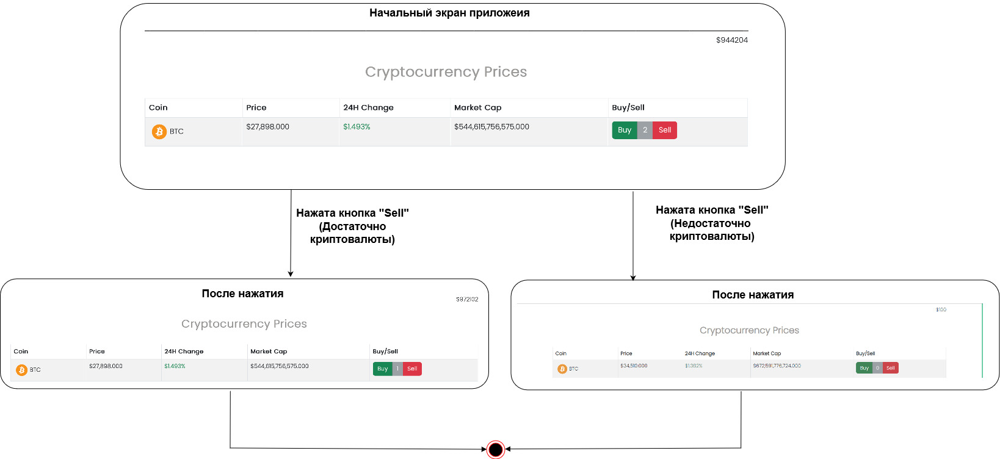

# Диаграммы состояний

# Содержание
1. [Получить дополнительную информацию о криптовалюте](#1)
2. [Купить криптовалюту](#2)
3. [Продать криптовалюту](#3)

### 1. Получить дополнительную информацию о криптовалюте

### 2. Купить криптовалюту

  
### 3. Продать криптовалюту

