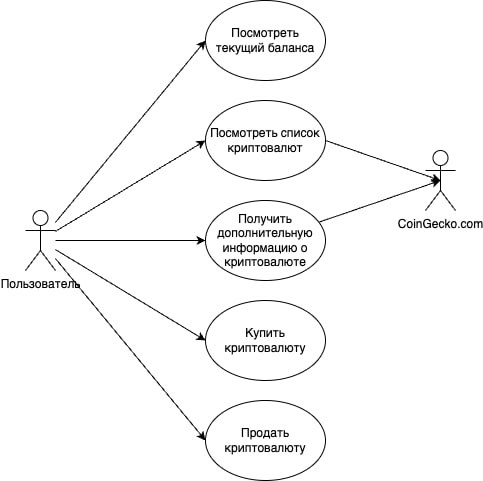

# Диаграмма вариантов использования

# Глоссарий

| Термин | Определение |
|:--|:--|
| Пользователь | Человек, использующий приложение |
| Список криптовалют | Список самых популярных криптовалют |

# Поток событий 

# 1 Актёры

| Актёр | Описание |
|:--|:--|
| Пользователь | Человек, использующий приложение |
| [coingecko.com](https://www.coingecko.com/) | Web-сайт, информация с которого используется приложением |

# 2 Варианты использования

## 2.1 Посмотреть текущий баланс

**Описание.** Вариант использования "Посмотреть текущий баланс" позволяет пользователю посмотреть текущий баланс.  
**Предусловия.** Пользователь вошел в приложение.  
**Основной поток.**
1. Приложение отображает главное окно;
2. Пользователь смотрит текущий баланс;
3. Вариант использования завершается.

## 2.2 Посмотреть список криптовалют

**Описание.** Вариант использования "Посмотреть список криптовалют" позволяет пользователю посмотреть список криптовалют.  
**Предусловия.** Пользователь вошел в приложение.  
**Основной поток.**
1. Приложение отображает главное окно;
2. Приложение запрашивает криптовалюты с coingecko.com;
3. Приложение отображает криптовалюты;
4. Вариант использования завершается.

## 2.3 Получить дополнительную информацию о криптовалюте

**Описание.** Вариант использования "Получить дополнительную информацию о криптовалюте" позволяет пользователю получить дополнительную информацию о криптовалюте.  
**Предусловия.** Пользователь нажал на криптовалюту в списке криптовалют.  
**Основной поток.**
1. Приложение отображает главное окно;
2. Пользователь нажимает на выбранную криптовалюту;
3. Приложение запрашивает дополнительную информацию о криптовалюте с coingecko.com;
4. Приложение отображает информацию о криптовалюте;
5. Вариант использования завершается.

## 2.4 Купить криптовалюту

**Описание.** Вариант использования "Купить криптовалюту" позволяет пользователю купить криптовалюту.  
**Предусловия.** Пользователь нажал на кнопку купить выбранной криптовалюты. Пользователю хватает баланса для покупки криптовалюты.  
**Основной поток.**
1. Приложение отображает главное окно;
2. Пользователь нажимает на кнопку купить выбранной криптовалюты;
3. Приложение вычитает стоимость криптовалюты из баланса;
4. Приложение прибавляет единицу к количеству данной криптовалюты;
5. Вариант использования завершается.

**Альтернативный поток А1.**
1. Приложение сообщает пользователю, что не хватает баланса для покупки криптовалюты;
2. Вариант использования завершается досрочн

## 2.5 Продать криптовалюту

**Описание.** Вариант использования "Продать криптовалюту" позволяет пользователю продать криптовалюту.  
**Предусловия.** Пользователь нажал на кнопку продать выбранной криптовалюты. Количество данной криптовалюты больше нуля.  
**Основной поток.**
1. Приложение отображает главное окно;
2. Пользователь нажимает на кнопку продать выбранной криптовалюты;
3. Приложение вычитает единицу из количества данной криптовалюты;
4. Приложение добавляет стоимость криптовалюты в баланс;
5. Вариант использования завершается.

**Альтернативный поток А2.**
1. Приложение сообщает пользователю, что количество криптовалюты ниже или равно нулю;
2. Вариант использования завершается досрочн
