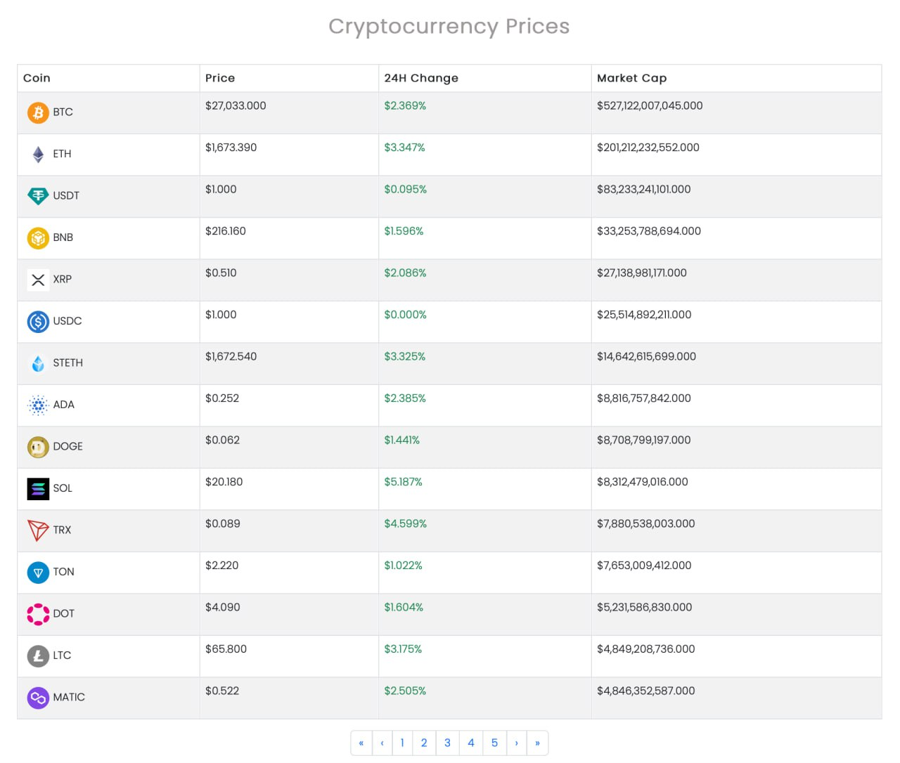
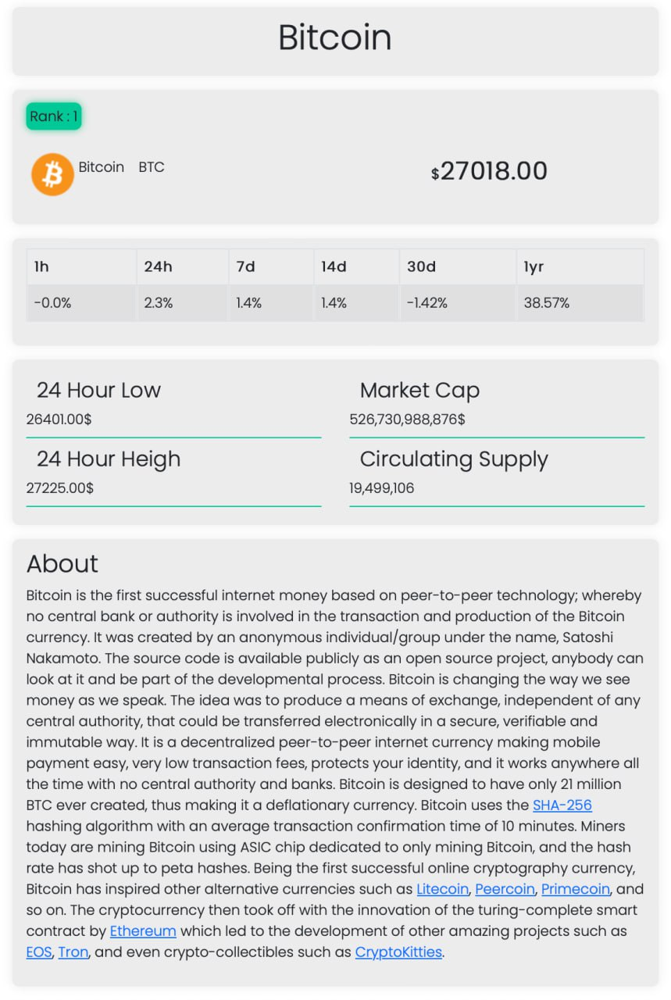

# Requirements Document

## 1 Introduction

CryptoMaster is an innovative and user-friendly web application designed to provide real-time cryptocurrency rates, empowering you to make informed decisions in the exciting world of digital assets.

## 2 User Requirements

### 2.1 System interfaces

- Web browser: Firefox >= 93.0
- Used tech: JavaScript, ReactJs
- Development tools: git, npm

### 2.2 User interface

In this user interface, the table displays the names of various cryptocurrencies along with their respective prices in USD, 24 hour price change and total market cap. Users can easily scroll through the list to view the prices of different cryptocurrencies. This straightforward interface provides users with a quick and clear overview of cryptocurrency prices.

You can click on any coin and get full information about it. Such as: currency price change, 24 hour lowest price, 24 hour highest price, circulating supply and information about it

### 2.3 Users Characteristics

CryptoMaster is a versatile application designed for users of all technical backgrounds. It primarily caters to individuals seeking assistance with mastering cryptocurrency investments, but it can also serve as an engaging alternative to conventional cryptocurrency tracking apps.

### 2.4 Assumptions and Dependencies

Older browser versions can incorrectly render application.

## 3 System requirements

### 3.1 Functional requirements

- Display cryptocurrencies list
- Get information about cryptocurrencies
- Provide cryptocurrencies price
- Get full info about specific cryptocurrency

### 3.2 Quality requirements(Non-functional)

For a cryptocurrency app that provides information about crypto rates, several quality attributes are crucial to ensure the app's functionality, user experience, and overall success. Here are some important quality attributes, along with explanations of their importance and how they can be measured:

 1. Reliability

    Users rely on accurate and up-to-date cryptocurrency information for trading and investment decisions. Reliability ensures that the app consistently provides accurate data without frequent disruptions.

 2. Security

    Cryptocurrency apps deal with sensitive financial data and user information. Ensuring security is vital to protect against unauthorized access, data breaches, and fraud.

 3. Usability and User Experience

    A user-friendly interface and a positive user experience are crucial for attracting and retaining users. Clear navigation and intuitive design enhance engagement.